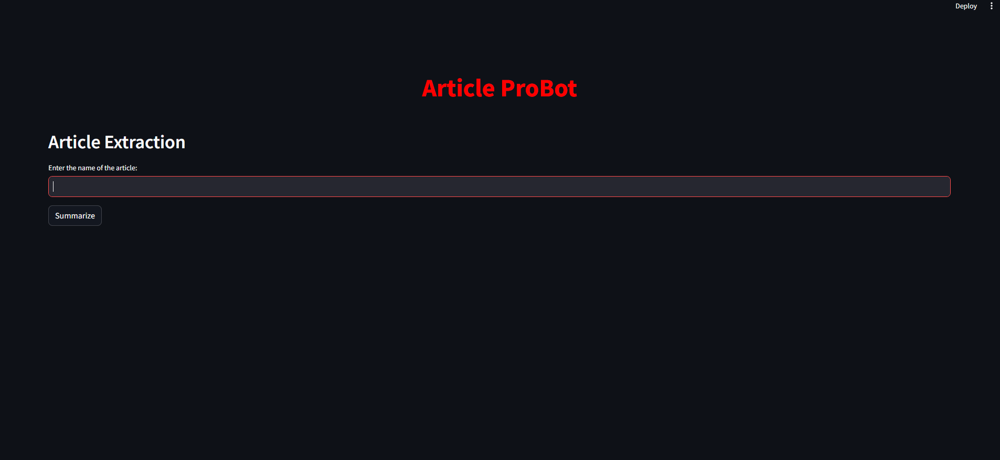
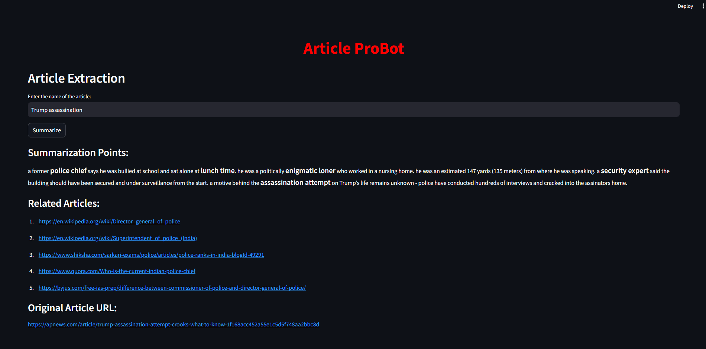

# Name Error - Article Extraction and Summarization


## Overview

**Article ProBot** is a web application built with Streamlit that allows users to extract content from articles, summarize the content, extract keywords, and find related articles based on those keywords. The application highlights the extracted keywords in the summarized text for better readability.

## Features

- Extract article content from Google search results.
- Summarize the article content using a pre-trained model.
- Extract keywords from the summarized content.
- Find related articles based on the extracted keywords.
- Highlight keywords in the summary for easy identification.

## Installation

1. Clone this repository:
    ```bash
    git clone https://github.com/yourusername/name_error.git
    cd name_error
    ```

2. Install the required packages:
    ```bash
    pip install -r requirements.txt
    ```

3. Run the Streamlit application:
    ```bash
    streamlit run name_error.py
    ```

## Usage

1. Enter the name of the article in the input field and press "Enter".
2. Click on the "Summarize" button to extract and summarize the article.
3. View the summarization points with highlighted keywords.
4. Check out related articles based on the extracted keywords.
5. Click on the original article URL to read the full article.

## Screenshots

### Home Page


### Summarized Content and Related Articles


## Technologies Used

- [Streamlit](https://streamlit.io/)
- [BeautifulSoup](https://www.crummy.com/software/BeautifulSoup/)
- [Transformers](https://huggingface.co/transformers/)
- [TextBlob](https://textblob.readthedocs.io/en/dev/)
- [Google Search API](https://pypi.org/project/googlesearch-python/)

## License

This project is licensed under the MIT License. See the [LICENSE](LICENSE) file for details.

## Acknowledgments

- Thanks to the [Streamlit](https://streamlit.io/) team for providing an excellent framework for building web applications.
- Special thanks to [Hugging Face](https://huggingface.co/) for their amazing Transformers library.

